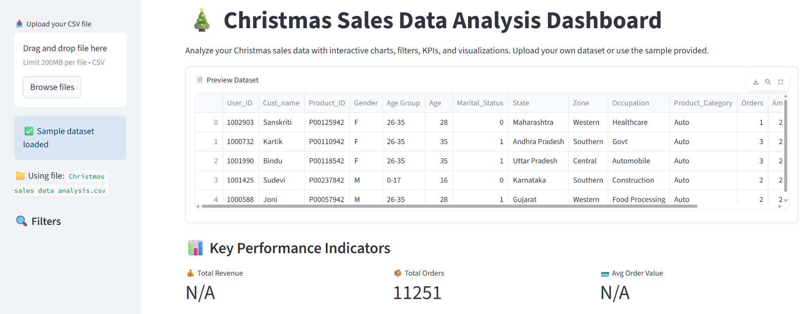
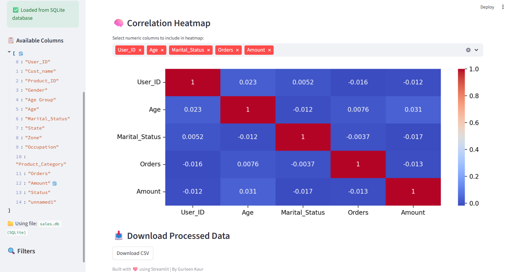

# 🎄 Christmas Sales EDA Dashboard with SQL Integration

An interactive **Exploratory Data Analysis (EDA)** dashboard built using **Streamlit** and **SQLite**, allowing users to analyze Christmas season sales data through visualizations, KPIs, filters, and custom SQL queries — all from the browser.

> Upload your own dataset or query the pre-loaded SQLite database using built-in tools.

---

## 🚀 Features

- 📤 Upload and analyze your own `.csv` dataset
- 🧮 Automatically uses `sales.db` (SQLite) if no file is uploaded
- 🧾 **Custom SQL query interface** for advanced analysis
- 📋 **Live view of available columns and schema** to assist query building
- 📊 Key Performance Indicators:
  - Total Revenue
  - Total Orders
  - Average Order Value
- 📦 Revenue by Product Category (Bar Chart)
- 🌍 Revenue Distribution by Region (Pie Chart)
- 🧠 Correlation Heatmap with selectable numeric features
- 📅 Filter by date range (if `Date` column is present)
- 📥 Download filtered/processed data as `.csv`

---
## 🧰 Tech Stack

- Frontend: [Streamlit](https://streamlit.io/)
- Backend: SQLite for embedded querying
- Visualization: Matplotlib, Seaborn
- Data handling: Pandas, NumPy

---

## ⚙️ How to Run Locally

1. **Clone the repository**  
   ```bash
   git clone https://github.com/yourusername/Christmas-Sales-EDA.git
   cd Christmas-Sales-EDA
   ```
2. **Install dependencies**
pip install -r requirements.txt

3. **(Optional) Generate SQLite database from CSV**
```
python create_db.py
```
4. **Run the Streamlit app**
```
streamlit run app.py
```
---

## 📷 Screenshots

### Dashboard 


### KPIs  



