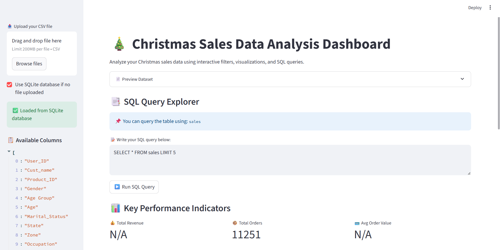
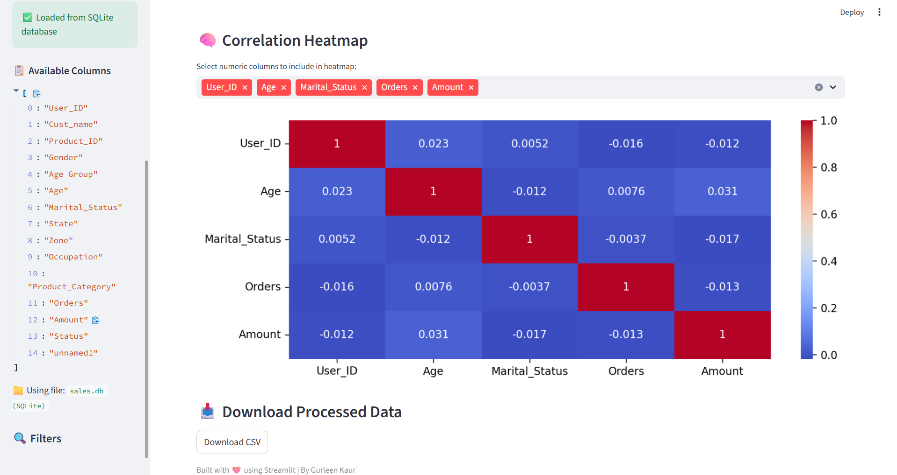

# 🄠Christmas Sales EDA Dashboard

An interactive **Exploratory Data Analysis (EDA)** dashboard built using **Streamlit**, enabling users to analyze sales trends, KPIs, and customer behavior from Christmas season sales data.

> 🔠Upload your own dataset or explore the built-in demo data (`Christmas sales data analysis.csv`) using real-time visualizations.

---

## 🚀 Features

- 📤 Upload your own `.csv` dataset
- 📊 Key Performance Indicators (KPIs):
  - Total Revenue
  - Total Orders
  - Average Order Value
- 📦 Sales by Product Category (Bar Chart)
- 🌠Sales Distribution by Region (Pie Chart)
- 🧠 Correlation Heatmap with column selection
- 📥 Download processed data as CSV
- 📅 Filter by date range (if Date column is present)
- Fully responsive layout using **Streamlit**

---

## 📷 Screenshots

### Dashboard 

### KPIs  

